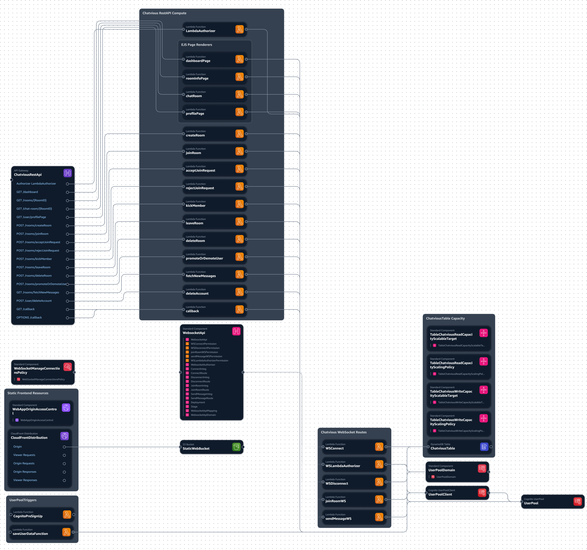

# **Chatvious Project**
### Hello and welcome to my real time chat app project I made. 

This is a project I am making to learn more about web development and improve my skills. I Have learned a lot about web development when making this project and about serverless technologies as well. Thank you for stopping by to read this and I hope you enjoy what I have made.

## Resources and technologies used to make this project
### Front End
The front end and static resources of this website is made by a few different things. For the main and about pages, they are made with **React** and I am bundling my React app using **webpack**. The rest of the pages are made with **Ejs** and javascript and their static assest are also bundled with webpack. All my pages use **tailwind** with **daisy** ui for the css.

### Backend
There are some pages that I rendered in the backend with **Ejs**. The reason I choose to use ejs was because I wanted to try server side rendering because it seemed interesting. There are definitly some problems I had with ejs like a formater and bundling problems but there doesn't seem to be many server side rendering tools for nodejs. Ejs can also be used in the browser which I did to render some elements.

I wanted to try working with serverless technologies and all my infrastructure is built on aws with the help of the **AWS Serverless Application Model (AWS SAM)** which is an infrastructure as code tool to help provision AWS infrustructure. The AWS infrustructure I used to build this app are as follows.
- **API Gateway (REST and WebSockets)**: The app utilizes both REST and WebSocket APIs to handle HTTP requests and real-time communication.
- **Lambda Functions (compute)**: The backend compute which is mainly invoked and ran by Api Gateway
- **DynamoDB (storage)**: I use DynamoDB as the Database to this website.
- **User Authentication**: Amazon Cognito User Pools manage user sign-up, sign-in, and authentication processes.
- **Content Delivery**: The static front-end content is served through an Amazon CloudFront distribution, sourced from an S3 bucket.

Below is an Image about how the aws infrustructure I used works. I got this image from a tool called **Application Composer** which helps build AWS SAM templates and CloudFormation templates.

I also Learn CI/CD with github actions to help automate my workflow

## How to use the project
If you would like to build the project your self to try it out, this section can help you.

For the static main and about pages the code and assets are stored in the **client** directory. navigate there and run `npm run build` to bundle the code or `npm run build:prod` for a production build. Use `npm run serve` to get a dev server with hot module reloading. This only builds the front end.

For the Static assets of the ejs pages, those are in the **ejs-static** directory. To build static assets, make sure to be in that directory to run commands and it has the same build and build:prod commands as the client directory. It also has 2 other commands. The first is `npm run dev`. The reason I made this was to be able to see the visual updates on my ejs rendered pages faster. without this, I would have to start the local api gateway AWS SAM provides which takes a bit for the containers to start up. The second command is `npm run static`. The reason I made this command is so I an serve my static assets when I am running the ejs pages in lambda functions locally with api gateway or when I use npm run dev which can also get the served static assets. This command also serves the static assets from the client directory so you can see the other pages. It also starts a simple websocket server that connects to my chat-room page with simple functionality. This is to be able to see how new chat messages are rendered and test the client websocket functionality.

The Backend is in the **serverless-aws-sam directory**. Make sure to navigate to the root of that directory, run `npm install`, and then run `sam build` to build and bundle the code. This will turn your AWS Sam template **(template.yaml)** into a cloudformation template. This also packages all the functions in the template and all the built resouces will to into the .aws-sam directory. The functions are packaged with esbuild which is specified in the sam template. If you are wondering why there is a make file, this is so I was able to package the views directory which contains the ejs templates into the lambda function's as well for the lambda functions that used ejs to render pages. If you would like to run a local version of a api gateway (Rest Api), use the `sam local start-api --env-vars env-vars/env.json`. You have to have docker running in order for this to work. the ejs rendered pages also doesn't work without a cognito User Pool Up. From there, it should start locally and be accessible via localhost. If you want to read more about AWS Sam, here is the documentation <https://docs.aws.amazon.com/serverless-application-model/latest/developerguide/what-is-sam.html>.

If you would like to try out the test I have made You first need a local dynamodb running on port 8000. I used NoSQL Workbench for this but you can use anything that runs dynamodb, like in a container. Once that is up change into the **serverless-aws-sam directory/src** directory and install the npm dependancies if you haven't already with `npm install`. Then to run the test, run `npm run test`.

## Conclusion
Thank you for taking some time to check out what I have built and I hope you like it. I have learned a lot about web development when working on this project. This project was originally just a nodejs project with the express framework but I changed that with things I wanted to try out. Thanks again and I hope you have a wonderful day!
